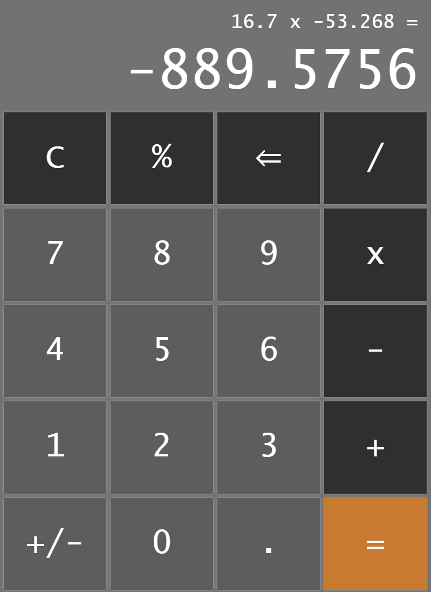

# odin-calculator

A project for creating a calculator for [The Odin Project Foundations course](https://www.theodinproject.com/paths/foundations/courses/foundations). The calculator is on a webpage, which is created using HTML, CSS and JavaScript. A live version can be viewed [on GitHub pages](https://studsministern.github.io/odin-calculator/).

&nbsp;

# features

The calculator supports addition `+`, subtraction `-`, multiplication `x`, division `/` and modulo `%`. It allows decimal numbers with the `.` button and switching positive/negative numbers with `+/-`. `C` clears everything and `⇐` is a backspace button. 

&nbsp;

  

&nbsp;

Features also include:

- Display for the current/previous calculation. In the example above, the previous calculation is `16.7 x -53.268 =`.
- Chained calculations with operators. For example the input `12 + 7 - 5 * 3 =` will give the result 42.
- Repeat calculations by pressing `=`. For example `2 + 2 = 4`. The next press of `=` will result in `4 + 2 = 6` etc.
- Variable font size so large values or many decimal places doesn't overflow the display.
